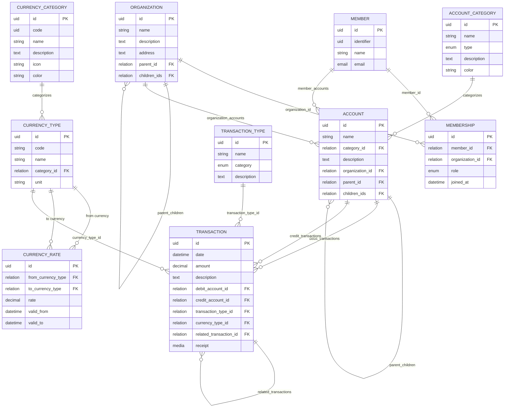

# Community Unified Resource Registry (CURR)

alias

# Közösségi Önjegyző Render (KÖR)

## Unified Data Model

Purpose:
This system manages community-based resource accounting, where members, organizations, and activities interact through multi-currency transactions (money, time, food, goods, etc.).
Each transaction is recorded using double-entry bookkeeping principles with debit and credit entries.

### Use Cases

#### Member Use Cases

- **As a member**, I would like to see my own balance and transaction history.
- **As a member**, I would like to make transactions to the organization fund.

#### Accountant Use Cases

- **As an accountant**, I would like to enter member fees and payments.
- **As an accountant**, I would like to schedule future member fees.
- **As an accountant**, I would like to register new invoices.
- **As an accountant**, I would like to import transactions from a file.

#### Management Use Cases

- **As a project owner**, I would like to see my project balance as a report.
- **As a board member**, I would like to see all project balances across the organization.

#### System Use Cases

- **Expense tracking**: The system can track expenses that belong to specific projects or locations.
- **Multi-currency support**: Transactions can be made in different currencies with automatic conversion.

### 💬 Entity Overview

| Entity               | Description                                                                        | Sample Values                                                                              |
| -------------------- | ---------------------------------------------------------------------------------- | ------------------------------------------------------------------------------------------ |
| **Member**           | A community participant (individual).                                              | John Doe, jane@example.com                                                                 |
| **Organization**     | Collective entity managing resources and members (hierarchical structure).         | Zöld források szövetkezet @Szupatak, Igaz Szeretet forrás Egyesület, Kömlődi állatidomárok |
| **Membership**       | Relation between a Member and an Organization, storing their role.                 | tag, bentlakó tag, szimbpatizáns                                                           |
| **AccountCategory**  | Categories for financial accounts (revenue, expense, asset, liability, equity).    | Revenue, Expense, Asset, Liability, Equity                                                 |
| **Account**          | Financial account within an organization (hierarchical structure).                 | Cash Account, Revenue Account, Expense Account, Asset Account                              |
| **CurrencyCategory** | Organizes currency types into logical groups.                                      | Cash 💰, Labor ⏰, Resources 🌾, Assets 🏠                                                 |
| **CurrencyType**     | Defines currencies or other measurable resource units (cash, labor, goods).        | HUF, EUR, HOUR, WHEAT, TRACTOR, CHICKEN                                                    |
| **CurrencyRate**     | Defines conversion rates between resource types over time (with validity periods). | HUF→EUR: 0.0026, HOUR→HUF: 3000                                                            |
| **TransactionType**  | Categorizes transactions (income, expense, transfer).                              | Elrendelt, Utalás, Készpénz, Átvezetés, Jutalék, Barter                                    |
| **Transaction**      | Double-entry bookkeeping record with debit and credit entries.                     | Debit: Cash Account 5000 HUF, Credit: Revenue Account 5000 HUF                             |

## 🔄 Key Changes & Improvements

### Major Structural Changes

1. **Removed Division Entity**: Eliminated the intermediate Division entity to simplify the data model
2. **Organization Hierarchy**: Organizations now support parent-child relationships for complex organizational structures
3. **Account Hierarchy**: Accounts support parent-child relationships for detailed account categorization
4. **Direct Organization-Account Relationship**: Accounts now connect directly to Organizations (OneToMany)

### Double-Entry Bookkeeping Implementation

- **Transaction Structure**: Changed from single-entry to double-entry bookkeeping
- **Debit/Credit Fields**: Each transaction now has `debit_account` and `credit_account` fields
- **Automatic Balance**: Every transaction must have equal debits and credits
- **Better Audit Trail**: Complete financial history for each account

### New AccountCategory Entity

- **Separate Content Type**: Account categories are now a separate entity instead of an enumeration
- **Flexible Configuration**: Categories can be customized per organization
- **Visual Organization**: Includes color coding for better UI representation

### Enhanced Currency Rate Management

- **Validity Periods**: Added `valid_to` field for currency rate expiration
- **Historical Tracking**: Better support for rate changes over time

### Media Support

- **Receipt Attachments**: Transactions can include receipt images/files
- **Cloudinary Integration**: Media files stored on Cloudinary CDN

#### Missing items to consider for further addition

- Member's Competencies
- Organization might required further physical Location entity
- Task management (with Trello integration)
- Time management tool for labour hours
- Target account payment can be Egyesület / Szövetkezet
