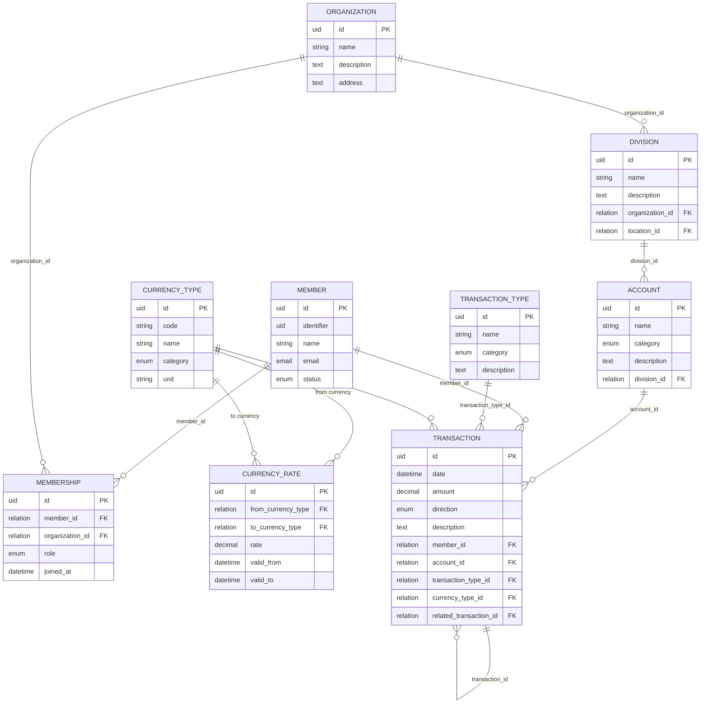

# Community Unified Resource Registry (CURR)

alias

# Közösségi Önjegyző Render (KÖR)

## Unified Data Model

Purpose:
This system manages community-based resource accounting, where members, organizations, locations, and activities interact through multi-currency transactions (money, time, food, goods, etc.).
Each transaction is recorded in a simplified single-entry ledger.

### Use cases

### 💬 Entity Overview

| Entity              | Description                                                                 | Sample Values                                       |
| ------------------- | --------------------------------------------------------------------------- | --------------------------------------------------- |
| **Member**          | A community participant (individual).                                       | John Doe, jane@example.com, resident                |
| **Organization**    | Collective entity managing resources and members.                           | Zöld források szövetkezet, Kömlődi állatidomárok    |
| **Membership**      | Relation between a Member and an Organization, storing their role.          | gardener, coordinator, 2024-01-15                   |
| **Division**        | A structured unit of work within an organization, linked to a location.     | Spring Planting, Community Kitchen                  |
| **Account**         | A defined action or operation type (e.g. gardening, maintenance).           | gardening, maintenance, cooking                     |
| **CurrencyType**    | Defines currencies or other measurable resource units (cash, labor, goods). | HUF, HOUR, KG_WHEAT, cash, labor                    |
| **CurrencyRate**    | Defines conversion rates between resource types over time.                  | HUF→EUR: 0.0026, HOUR→HUF: 5000                     |
| **TransactionType** | Categorizes transactions (income, expense, transfer).                       | income, expense, internal                           |
| **Transaction**     | Single-entry record of resource inflow or outflow.                          | +5000 HUF, -2 HOUR, deposit payment, gardening work |

#### Missing items to consider for further addition

- Member's Competencies
