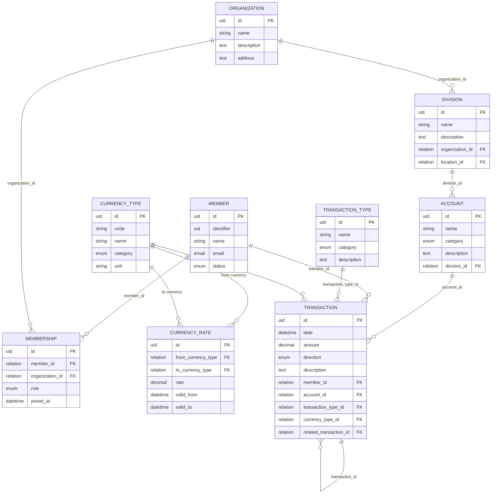

# Community Unified Resource Registry (CURR)

alias

# Közösségi Önjegyző Render (KÖR)

## Unified Data Model

Purpose:
This system manages community-based resource accounting, where members, organizations, locations, and activities interact through multi-currency transactions (money, time, food, goods, etc.).
Each transaction is recorded in a simplified single-entry ledger.

### Use Cases

#### Member Use Cases

- **As a member**, I would like to see my own balance and transaction history.
- **As a member**, I would like to make transactions to the organization fund.

#### Accountant Use Cases

- **As an accountant**, I would like to enter member fees and payments.
- **As an accountant**, I would like to schedule future member fees.
- **As an accountant**, I would like to register new invoices.
- **As an accountant**, I would like to import transactions from a file.

#### Management Use Cases

- **As a project owner**, I would like to see my project balance as a report.
- **As a board member**, I would like to see all project balances across the organization.

#### System Use Cases

- **Expense tracking**: The system can track expenses that belong to specific projects or locations.
- **Multi-currency support**: Transactions can be made in different currencies with automatic conversion.

### 💬 Entity Overview

| Entity              | Description                                                                 | Sample Values                                                                                                                                                                                                                                           |
| ------------------- | --------------------------------------------------------------------------- | ------------------------------------------------------------------------------------------------------------------------------------------------------------------------------------------------------------------------------------------------------- |
| **Member**          | A community participant (individual).                                       | John Doe, jane@example.com                                                                                                                                                                                                                              |
| **Organization**    | Collective entity managing resources and members.                           | Zöld források szövetkezet @Szupatak, Kömlődi állatidomárok                                                                                                                                                                                              |
| **Membership**      | Relation between a Member and an Organization, storing their role.          | tag, bentlakó tag, szimbpatizáns                                                                                                                                                                                                                        |
| **Division**        | A structured unit of work within an organization, linked to a location.     | 1.1. IRÁNYÍTÁS ÉS SZEMÉLYZETI KÖZPONT, 1.2. KOMMUNIKÁCIÓS KÖZPONT, 2.4 PROMÓCIÓ ÉS MARKETING IGAZGATÓSÁG, 3.9 NYILVÁNTARTÁSOK, VAGYONTÁRGYAK, 4.10 TERVEZÉSI KÖZPONT, 4.11 TERÜLET KIALAKÍTÁS, 4.12 TERMELÉS IRÁNYÍTÁS, 4.12.1 MEZŐ- ÉS ERDŐGAZDÁLKODÁS |
| **Account**         | A defined action or operation type (e.g. gardening, maintenance).           | orchard retail shop, food production, deer retail service                                                                                                                                                                                               |
| **CurrencyType**    | Defines currencies or other measurable resource units (cash, labor, goods). | HUF (partial note/részjegy), labor Hour, Natural resource, property (tractor), raw material (rooftile), lifestock (chicken), etc                                                                                                                        |
| **CurrencyRate**    | Defines conversion rates between resource types over time.                  | HUF→EUR: 0.0026, labour hour→HUF: 3000                                                                                                                                                                                                                  |
| **TransactionType** | Categorizes transactions (income, expense, transfer).                       | Elrendelt, Utalás, Készpénz, Átvezetés, Jutalék, Barter                                                                                                                                                                                                 |
| **Transaction**     | Single-entry record of resource inflow or outflow.                          | +5000 HUF, -2 HOUR, deposit payment, gardening work                                                                                                                                                                                                     |

#### Missing items to consider for further addition

- Member's Competencies
- Organization / Division might required further physical Location entity
- Task management (with Trello integration)
- Time management tool for labour hours
- Division or project based role
